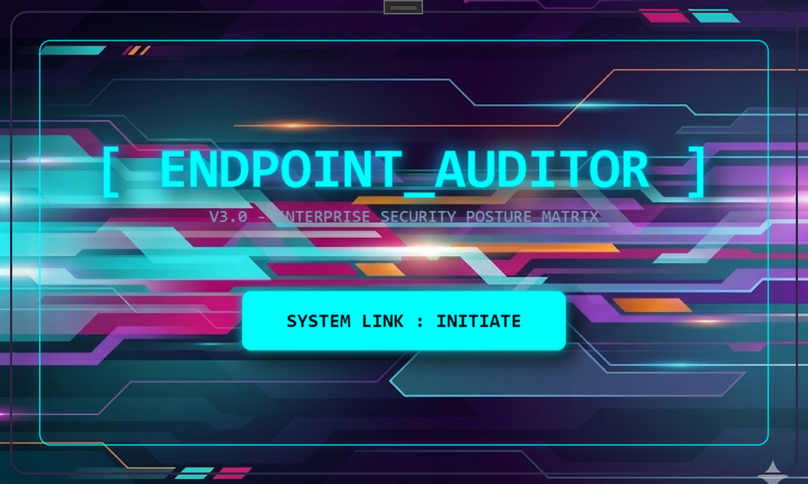
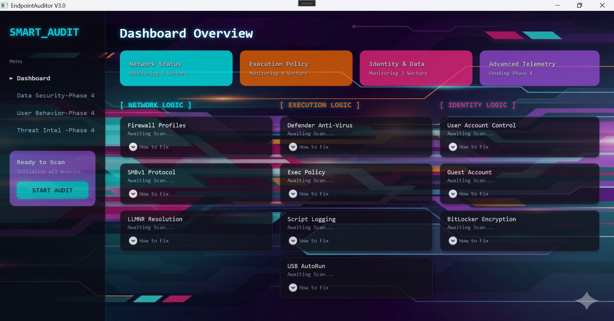
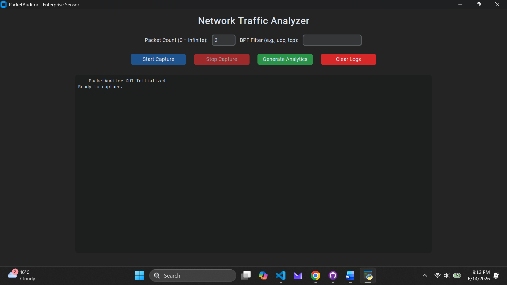
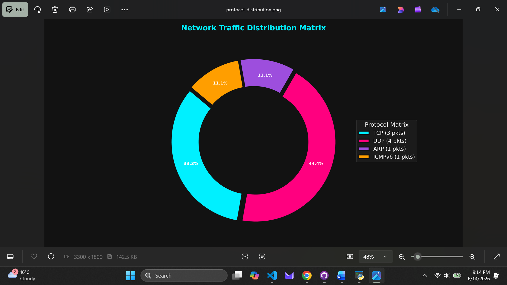
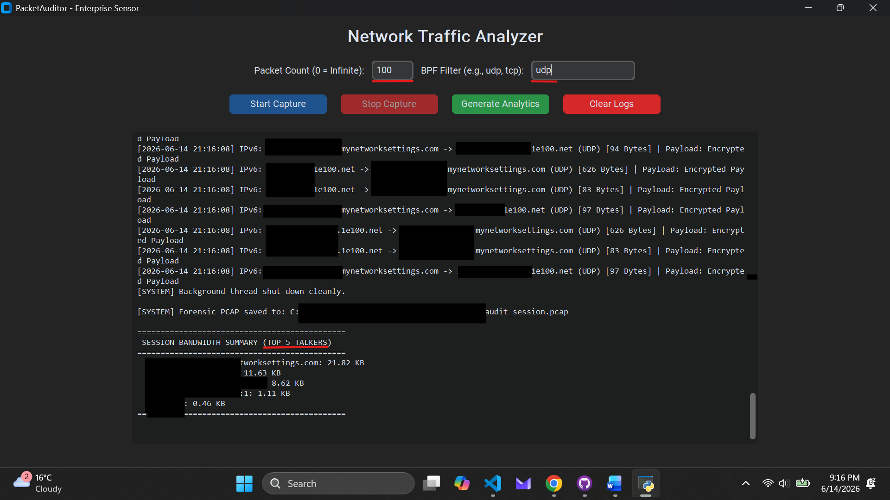
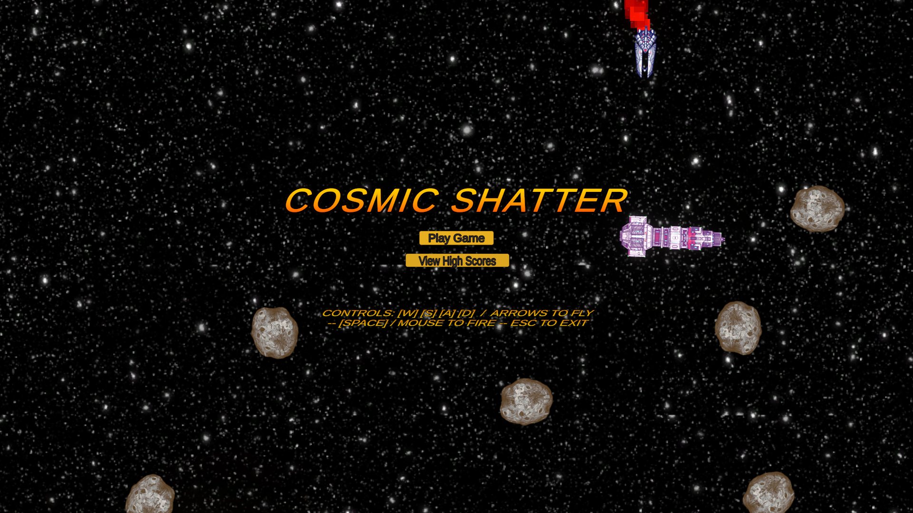
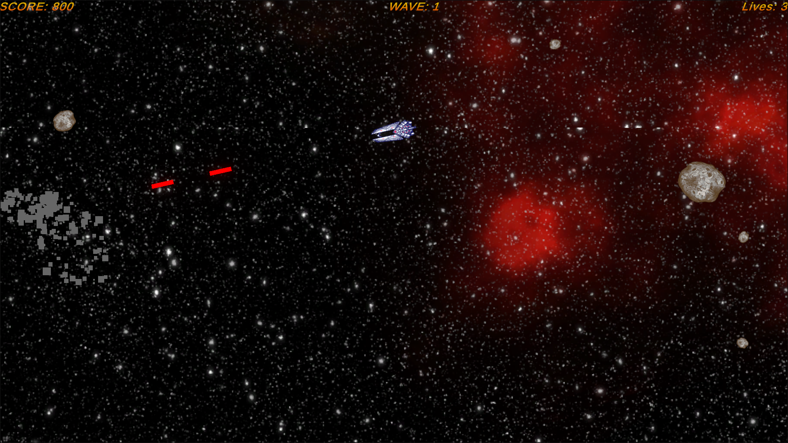
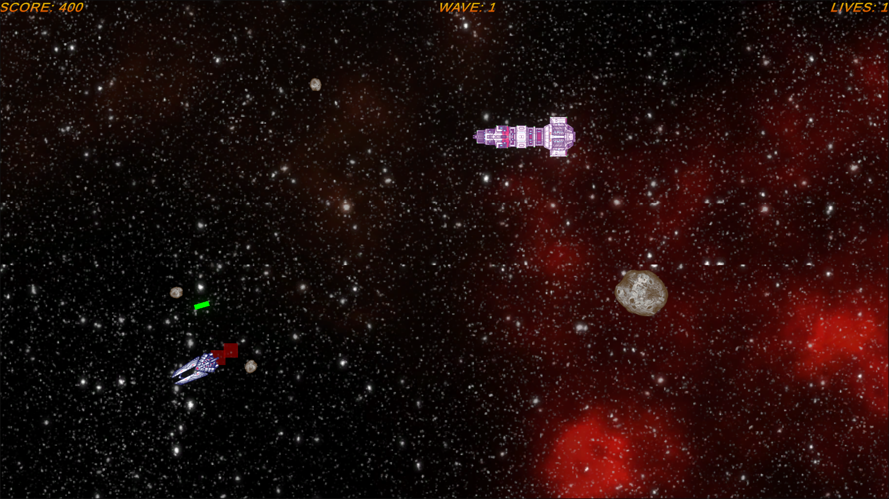
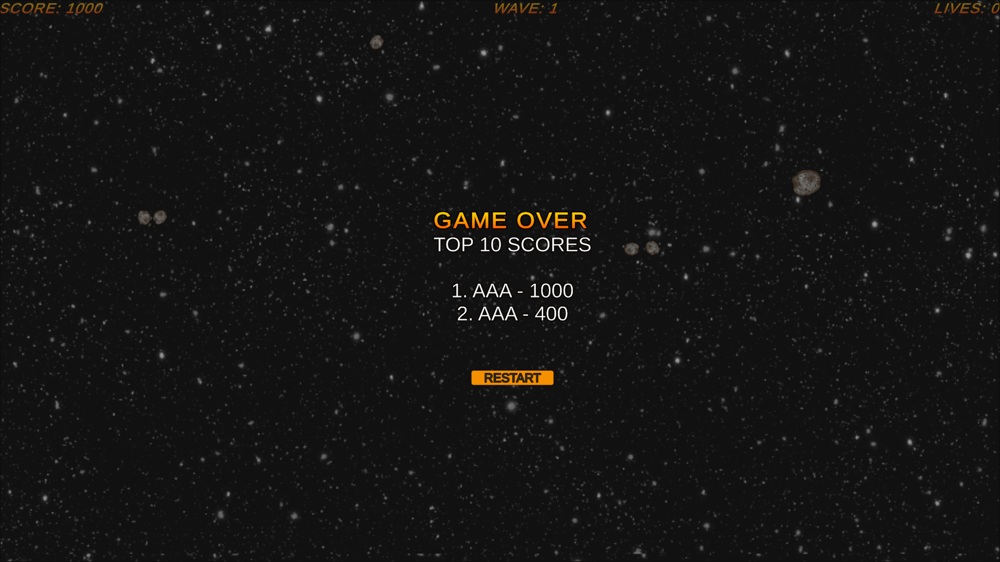

# Hi, I'm Chad Crowley 👋

I am a Computer Science and Cybersecurity student focused on secure network infrastructure, system modernization, and robust software development. I am passionate about bridging the gap between secure network architecture and efficient, scalable code, with a strong emphasis on the Separation of Concerns principle.

### 🔧 Technical Arsenal
* **Languages:** Python, C++, C#, Java, HTML
* **Security & Network Engineering:** Packet Analysis, Intrusion Detection (IDS), VLAN Segmentation, Firewall Configuration (Palo Alto, Meraki), HIPAA Compliance Standards
* **Frameworks & Libraries:** Scapy, CustomTkinter, Matplotlib, Socket
* **Tools & Game Engines:** Git, Wireshark, Visio, Unity

### 🚀 Featured Projects

* **[EndpointAuditor](https://github.com/ChadCrowley-Tech/EndpointAuditor.git)**
  A scalable security auditing tool engineered with a strict Separation of Concerns architecture. Built to transition seamlessly from a lightweight Command Line Interface (CLI) to a fully featured Graphical User Interface (GUI), ensuring clean, maintainable, and robust code.
   
  

    
    
    
    
  

* **[PersistenceAuditor](https://github.com/ChadCrowley-Tech/PersistenceAuditor.git)**
  PersistenceAuditor is a dedicated, WPF-based threat hunting and SIEM telemetry dashboard designed to identify, classify, and neutralize Windows persistence mechanisms.
Engineered in C# (.NET), the tool bridges the gap between endpoint forensics and enterprise Security Operations Centers (SOC). It conducts live static scanning across critical operating system hives and routes the telemetry through a decoupled architecture, allowing analysts to rapidly purge active threats or dispatch JSON-structured payloads to remote endpoints.
   
  

    
    
    
    
  

* **[PacketAuditor](https://github.com/ChadCrowley-Tech/PacketAuditor.git)**
  A multi-threaded, stateful network traffic analyzer and forensic logging engine built in Python. Engineered with a CustomTkinter GUI, it features deep packet inspection (DPI), live reverse-DNS threat intelligence mapping, automated forensic PCAP exporting, and thread-safe visual analytics.
   
  

    
    
    
  

* **[Cosmic Shatter](https://chadcrowley-tech.github.io/Cosmic-Shatter/)**
  A space-themed 2D arcade game developed in Unity (C#). Showcases custom UI scripting, core gameplay mechanics, and memory integrity management to protect the application runtime. Available to play directly in the browser.
   
  

    
    
    
    
  

### 📫 Let's Connect
* **Email:** ChadCrowley.Tech@proton.me

---
⚡ **Fun fact:** I have over 25 years of experience working with Windows operating systems, giving me a deep, foundational perspective on how software architecture and local network infrastructure have evolved over the decades. 

